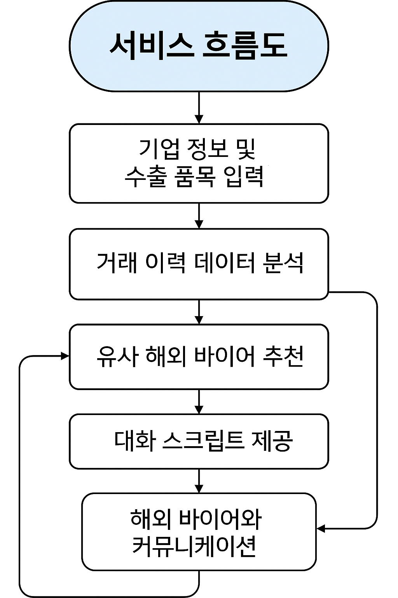

# TradeMatch_AI 서비스 흐름도

> 서비스 흐름도 초안 및 시스템 아키텍처, 주요 단계별 데이터 흐름 등을 기록하는 문서입니다.

---

## 서비스 흐름도 (예시)

```mermaid
[사용자 입력]
   ↓
[데이터 수집 단계]
   ↓
[LLM 분석 및 추천 단계]
   ↓
[추천 결과 출력]
   ↓
[커뮤니케이션 지원]
   ↓
[향후 선택 기능 (선택)]
```

---

## 설명
1. [사용자 입력]
    - 사용자가 기업 정보와 수출 품목을 입력합니다.
    - 프론트엔드에서 입력 폼을 통해 데이터를 수집합니다.
2. [데이터 수집 단계]
    - 백엔드 서버가 입력을 받아 공공데이터 API를 호출해 유사 바이어 데이터를 수집합니다.
    - 수집된 데이터를 LLM에 전달하여 바이어 추천 및 요약, 이메일 초안을 생성합니다.
    - 결과를 프론트엔드에 반환하여 카드 형태로 시각화하고, 이메일 초안도 제공합니다.
3. [LLM 분석 및 추천 단계]
    - LLM이 수집된 데이터를 분석하여 유사한 바이어를 추천합니다.
    - 추천 결과는 요약 형태로 제공되며, 이메일 템플릿도 생성됩니다.
4. [추천 결과 출력]
    - 추천된 바이어 목록과 요약 정보를 카드 형태로 프론트엔드에 표시합니다.
    - 사용자는 추천 결과를 확인하고, 이메일 초안을 검토할 수 있습니다.
5. [커뮤니케이션 지원]
    - 사용자가 추천된 바이어에게 보낼 이메일 초안을 자동 생성합니다.
    - 이메일 내용은 사용자가 수정할 수 있도록 제공됩니다.
6. [향후 선택 기능 (선택)]
    - 향후 추가 기능으로, 추천된 바이어와의 커뮤니케이션 이력을 저장하거나, 바이어와의 직접 연결 기능 등을 고려할 수 있습니다.
---
